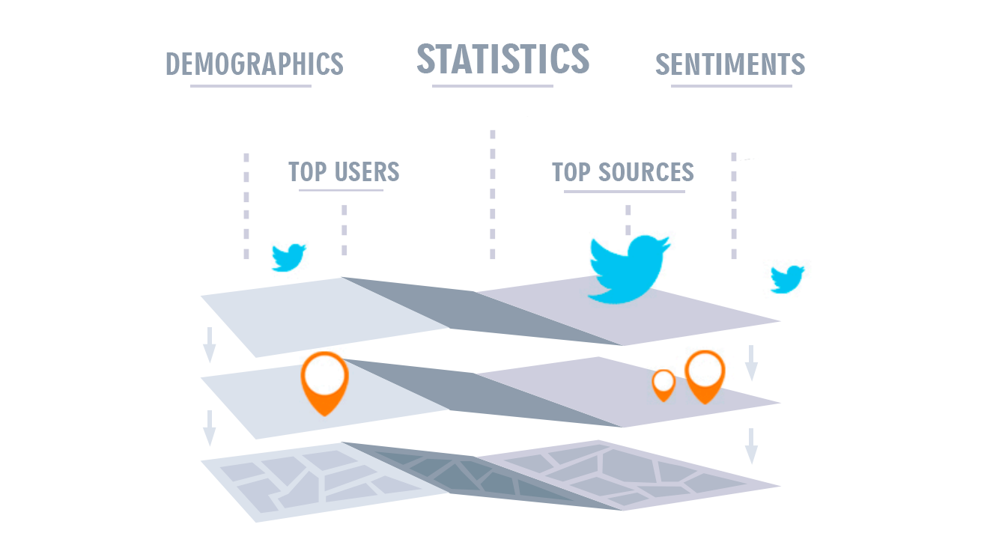
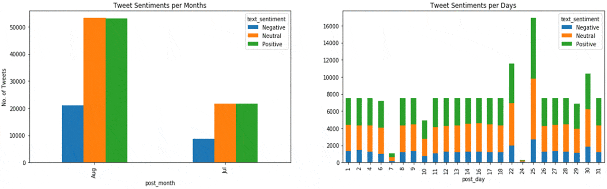

# COVID19 Tweets Data Analysis
Finding useful Insights from twitter data.

## Problem Statement
Perform **Analysis** on people tweets about COVID-19. Derive breakthrough insights like finding what kind of subjects use this hashtag, look at the geographical distribution (country), cluster and evaluate sentiments, look at trends (on an average, at least 7 substantial insights).

### About Data
Data consists of attributes of tweet like tweet text, likes, etc. and it's related information like username, user_followers, user_friends, etc.
- Data is in **csv** format, training samples: 179109 , features: 13 which various attributes.
- Data is **untidy**, i.e., it needs to be preprocessed first.

### Feature Engineering
- Along with original 13 attributes, I created 6 new additional features from existing features to get additional information from the dataset.
- I also created a seperate user growth dataset from the original dataset to analyse the behind the scenes of user account growths based on number of posts, number of followers increased, etc.

### Data Analysis Insights with understanding
- Data has **missing values**.
- There are mostly **Contineous Features** as well as some **Categorial Nominal Features**.

   
## Conclusion
**THE STORY TELLING**        
I have analysed the tweets dating from 24st July 2020 to 30th August 2020. Among all these tweets, 50% of the overall tweets were sent combined `Phones and Tablets`, 35% from `twitter website` and rest from other `3rd party sources`. However, top tweeters use more `twitter website` and `other sources`. This might be because they are professionals and have their own platforms, automations, etc.     

A very small sample of the users are verified in the total population, but it is not surprising that almost half users are verified in the top twitters list. They post more posts and are generally oldest amongst others. We can also notice that verified users have high followers but less number of friends. Also, the verified accounts that are old enough had a steep inclined verticle follower growth in this time span. 

Most of the tweets came from **geographical regions** of `India and USA` mainly from user accounts `GlobalPandemic.NET` and `Coronavirus Updates`. They posted their tweets each day around 4-6 am and 4-5 pm using the hashtags `covid19` and `coronavirus`. It is also intersting to note that most tweets mentioned `realdonaldtrump` that to almost daily. We can also see that posting more posts does not grow the account as much. The most growing accounts in these days are `Anonymous`, `CDC` and `Ministry of Health` and the most liked accounts are `ignazio marong`, `scarlet monahan` and `IAM Platform`.

If we analyse the **sentiment** of tweets, we that that only 17% of tweets possess negative sentiment from the top 10 sources and 20% of population of likes these tweets and the ratio of tweets for positive, neutral and negative sentiments for each day also remains almost the same. 

###### Interview Project by/for [Infeedo](https://infeedo.com/)
